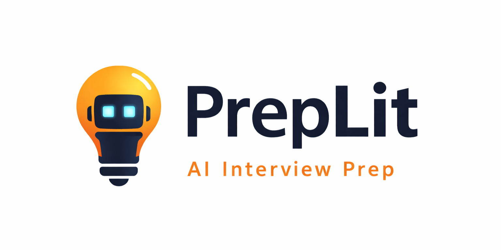
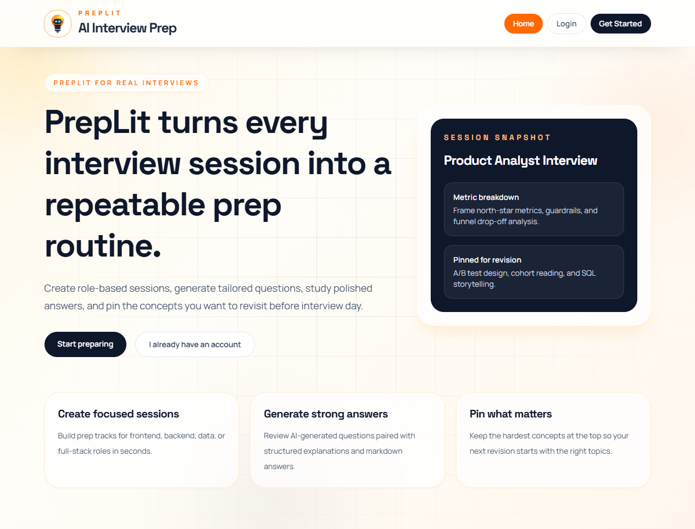
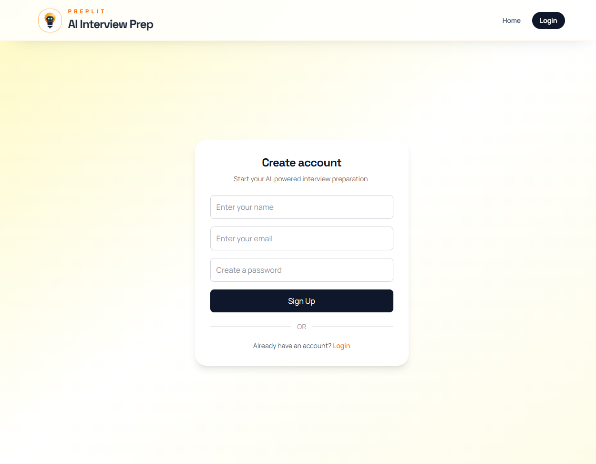
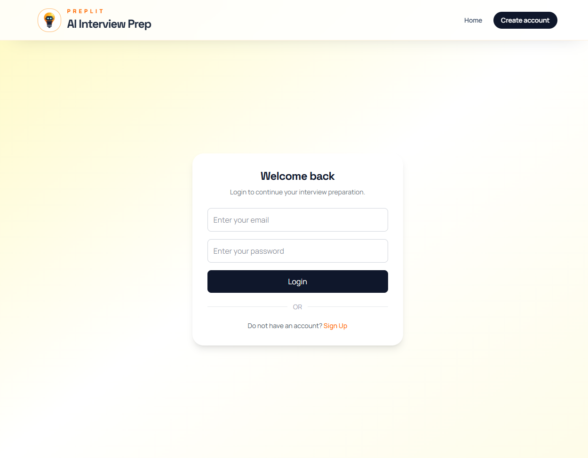
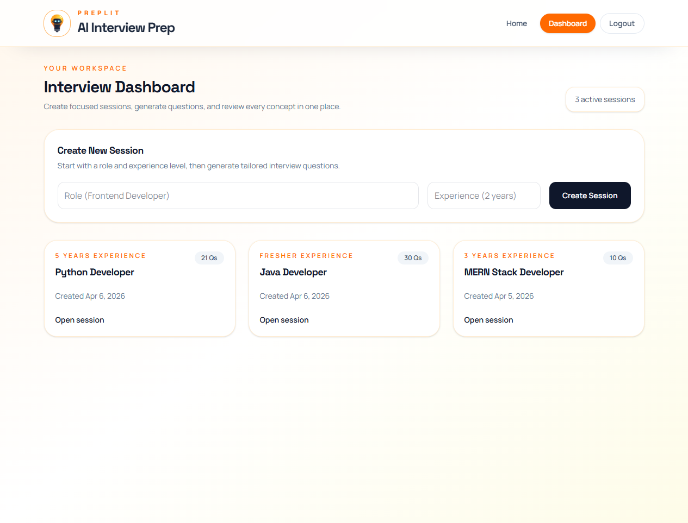
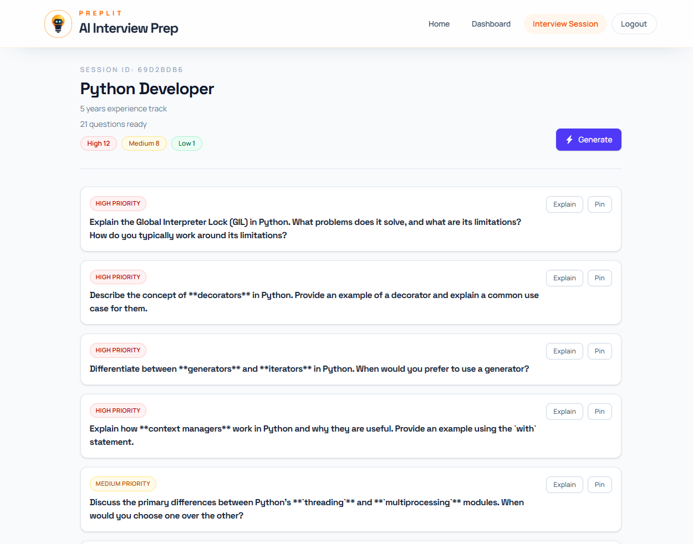
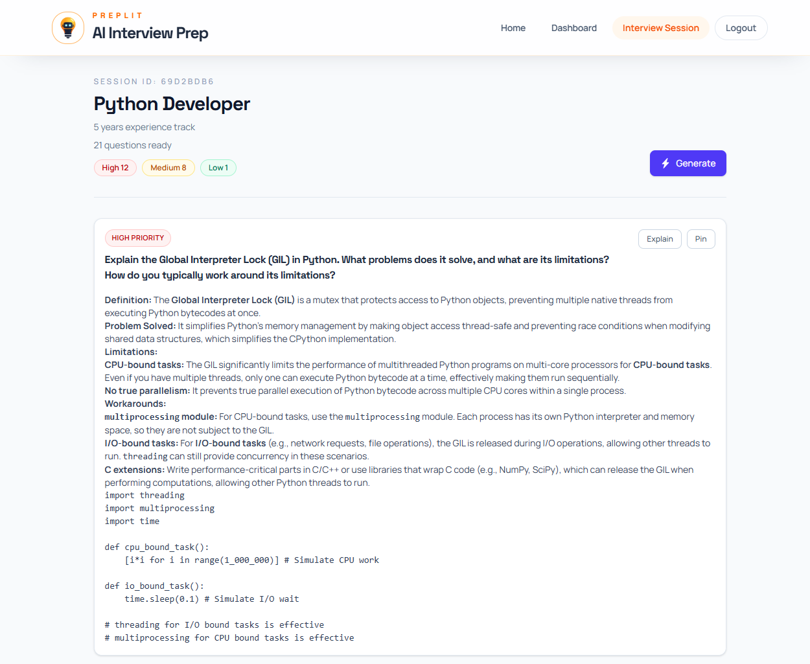
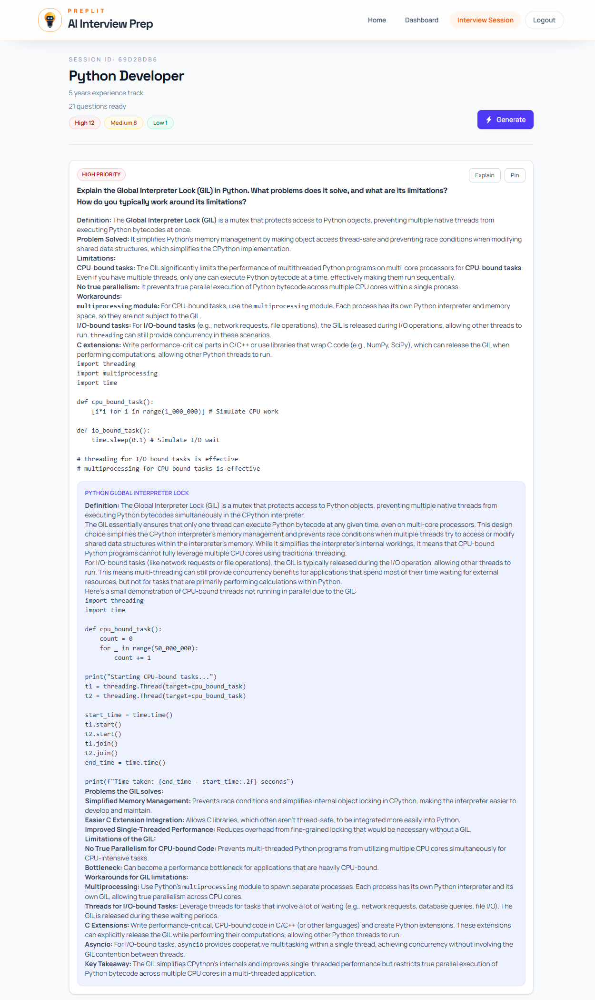

# PrepLit




## Live App

- Frontend: https://prep-lit.vercel.app/
- Backend API: https://preplit-server.onrender.com/

PrepLit is a React + Vite frontend for an AI-powered interview preparation experience. It helps users move from scattered prep to a focused workflow with guided sessions, generated questions, polished explanations, and a clean interface built for real interview practice.

## Why PrepLit? ✨

Interview prep can get messy fast. PrepLit brings everything into one place so users can create a session, generate relevant questions, review strong answers, and keep track of what needs more revision.

## Features 🚀

- Dynamic landing page with a rotating session snapshot preview
- Smooth signup and login flow
- Protected dashboard for creating and managing interview prep sessions
- AI-powered question generation for each session
- Explanation view with markdown-friendly content
- Pin/unpin support for prioritizing difficult topics
- Polished loading, empty, and error states across the app

## Screenshots 📸

A quick visual tour of the PrepLit experience.

### 🏠 Landing Page



Warm, clean, and focused on getting users into interview prep quickly.

### 📝 Sign Up



New users can create an account and start building their prep workflow in seconds.

### 🔐 Login



Returning users can jump right back into their saved interview sessions.

### 📊 Dashboard



The dashboard acts as the control center for creating and revisiting prep sessions.

### 💬 Interview Session



Each session groups generated questions into one focused review space.

### ✅ Answer View



Users can review stronger, more structured responses for better interview delivery.

### 🧠 Generated Explanation View



Explanations add depth so users understand concepts, not just memorized answers.

## Tech Stack 🛠️

- React 19
- Vite 7
- React Router 7
- Tailwind CSS 4
- Axios
- Framer Motion
- React Hot Toast
- React Markdown + Remark GFM

## Project Structure 🧭

```text
frontend/
|-- public/
|-- src/
|   |-- components/
|   |-- pages/
|   `-- utils/
|-- docs/
|   `-- screenshots/
|-- package.json
`-- vite.config.js
```

## Key Routes 🗺️

- `/` - landing page
- `/signup` - account creation
- `/login` - user login
- `/dashboard` - session creation and session list
- `/interview/:id` - question generation and session review

## Getting Started ⚡

### Prerequisites

- Node.js 18+
- npm
- Backend API running locally on `http://localhost:9000` or remotely on `https://preplit-server.onrender.com`

### Install

```bash
npm install
```

### Run The Frontend

```bash
npm run dev
```

### Build For Production

```bash
npm run build
```

### Preview Production Build

```bash
npm run preview
```

## Scripts 📜

- `npm run dev` - start the Vite development server
- `npm run build` - create the production build
- `npm run preview` - preview the production build locally
- `npm run lint` - run ESLint

## API Notes 🔌

The frontend reads its API base URL from `VITE_API_BASE_URL`. In this workspace it is set to `https://preplit-server.onrender.com/api`, and for local backend development you can switch it to `http://localhost:9000/api`.

The Axios instance also attaches the bearer token from `localStorage`, which keeps protected requests authenticated after login.

## Backend Deployment On Render

Use a Render Web Service for the `backend` folder with these values:

- Root Directory: `backend`
- Build Command: `npm install`
- Start Command: `npm start`

Set these environment variables in Render:

- `MONGODB_URI`
- `JWT_SECRET`
- `GEMINI_API_KEY`
- `CLIENT_ORIGIN`

Set `CLIENT_ORIGIN` to your deployed frontend URL, for example `https://your-frontend-app.vercel.app`.

If you deploy the frontend separately, set:

- `VITE_API_BASE_URL=https://preplit-server.onrender.com/api`

The checked-in `backend/.env` in the local workspace contains real secrets. Rotate those values before going live and keep them only in Render or local secret storage.

## Screenshot Assets 🖼️

Current screenshots are stored here:

```text
frontend/
`-- docs/
    `-- screenshots/
        |-- home.png
        |-- signup.png
        |-- login.png
        |-- dashboard.png
        |-- interview.png
        |-- answer.png
        `-- explain.png
```
